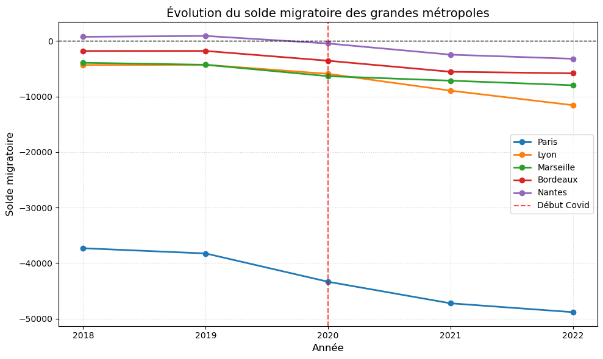
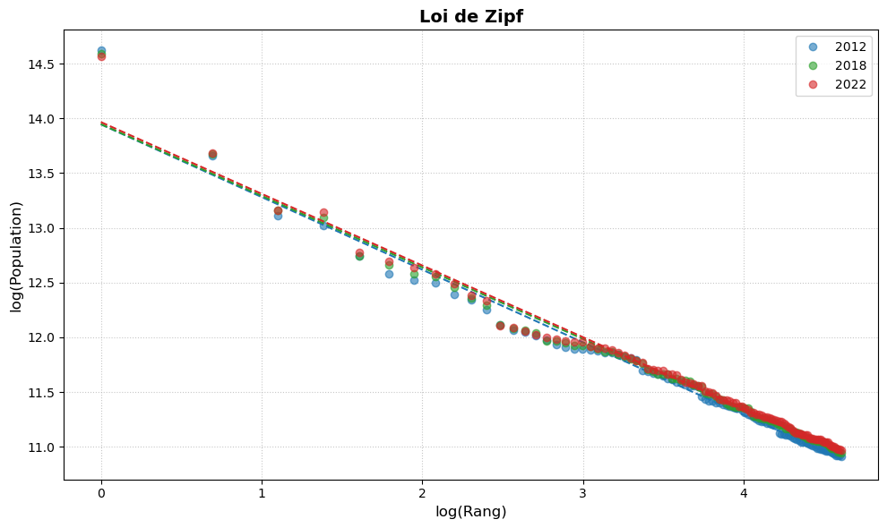
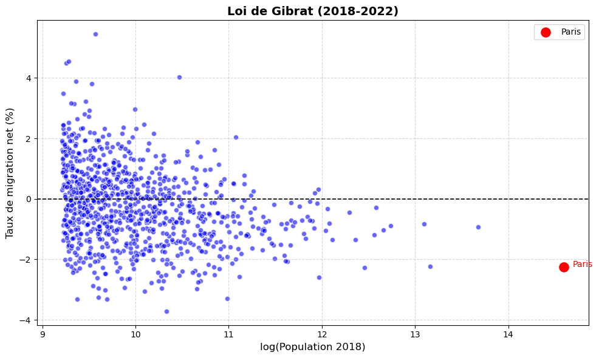

# UrbanFlows-FR — Analyse des flux migratoires inter-communaux français (2018-2022)

> Pipeline ETL, analyse exploratoire et vérification empirique des lois de **Zipf** et **Gibrat** sur les données INSEE de mobilité résidentielle, avec un focus sur l'effet du COVID-19 sur les grandes métropoles françaises.

**Stack :** Python · Pandas · NumPy · Matplotlib · Jupyter
**Auteur :** Ahmed EISH — Étudiant ingénieur CY Tech (Maths appliquées à la DATA/IA)

---

## Contexte

Projet réalisé dans le cadre du cursus de classe préparatoire intégrée à **CY Tech** (cours de macroéconomie urbaine). L'objectif est double :

1. **Cycle ETL complet** sur 5 millésimes de données INSEE (~125 Mo de CSV bruts, ~2 millions de flux migratoires inter-communaux).
2. **Vérification empirique** de deux lois fondamentales de l'économie urbaine sur le tissu communal français.

Ce projet est le premier volet d'une série orientée data/IA. Le second volet, [DataChat-FR](https://github.com/amdvii) (en cours), construira un agent IA conversationnel par-dessus ces datasets INSEE.

---

## Données

| Dataset | Source | Description |
|---|---|---|
| Flux mobilité résidentielle 2018-2022 | [INSEE — Base flux mobilité résidentielle](https://www.insee.fr/fr/statistiques/7637844) | Flux migratoires inter-communaux annuels (~400 k lignes/an) |
| Population municipale 2012, 2018, 2022 | [INSEE — Populations légales](https://www.insee.fr/fr/statistiques/2521169) | Populations communales recensées (fichier `ensemble.xls/xlsx`) |

> ⚠️ Les fichiers de données ne sont **pas inclus** dans le repo (volumineux, > 100 Mo). Voir la section [Reproduction](#reproduction) pour les télécharger et les placer dans `inputs/`.

---

## Pipeline

```
inputs/                                    notebooks/                              outputs/
  base-flux-mobilite-residentielle-      ┌──────────────────────────────┐        flux_migratoire_triee.csv
    2018.csv ─┐                          │ 01_tri_donnees.ipynb         │ ──────►   (~2 M lignes nettoyées,
    2019.csv  │                          │  ETL: nettoyage, fusion,     │           5 millésimes fusionnés)
    2020.csv  ├────────────────────────► │  filtrage flux étrangers,    │
    2021.csv  │                          │  exclusion auto-flux         │
    2022.csv ─┘                          └──────────────────────────────┘                │
                                                                                          │
                                          ┌──────────────────────────────┐                │
  ensemble2012.xls ──┐                    │ 02_analyse_solde_migra.ipynb │ ◄──────────────┤
  ensemble2018.xlsx  ├──────────────────► │  EDA: solde migratoire par   │ ──────► graphique_solde_migra.png
  ensemble2022.xlsx ─┘                    │  métropole, choc COVID 2020  │
                                          └──────────────────────────────┘
                                                                                          │
                                          ┌──────────────────────────────┐                │
                                          │ 03_loi_Zipf_Gibrat.ipynb     │ ◄──────────────┘
                                          │  Modélisation: régression    │ ──────► Loi_de_Zipf.png
                                          │  log-log, taux de migration  │         Loi_de_Gibrat.png
                                          │  net, détection d'outliers   │
                                          └──────────────────────────────┘
```

### 1. ETL — `01_tri_donnees.ipynb`

- Lecture des 5 CSV INSEE (séparateur `;`, encodage Latin-1).
- Détection automatique de la colonne `NBFLUX_*` (le nom varie selon le millésime).
- **Filtrages :**
  - Suppression des flux d'origine étrangère (codes commençant par `99`).
  - Exclusion des flux intra-communaux (code origine = code destination).
  - Suppression des flux nuls ou manquants.
- Renommage des colonnes (`CODGEO` → `code_dest`, `DCRAN` → `code_orig`, etc.).
- Concaténation des 5 millésimes → `outputs/flux_migratoire_triee.csv`.

### 2. EDA — `02_analyse_solde_migra.ipynb`

Calcul du **solde migratoire** annuel (`arrivées − départs`) pour les 5 plus grandes métropoles françaises (Paris, Lyon, Marseille, Bordeaux, Nantes), avec gestion des arrondissements (regroupement des codes `751**`, `6938*`, `132**`).



**Lectures clés :**
- **Paris** se distingue par un solde structurellement très négatif (~ −37 000 en 2018 → ~ −49 000 en 2022).
- Les autres métropoles sont également déficitaires mais d'un ordre de grandeur inférieur.
- **Le COVID-19 (mars 2020) accélère la décroissance** : toutes les courbes basculent plus fortement après le trait pointillé rouge.
- **Nantes** était la seule métropole à solde positif jusqu'en 2019 ; elle bascule en territoire négatif post-COVID.

### 3. Modélisation statistique — `03_loi_Zipf_Gibrat.ipynb`

#### Loi de Zipf

La loi de Zipf prédit que dans une distribution de villes triée par taille décroissante, $\log(\text{population}) \approx C - \alpha \cdot \log(\text{rang})$, avec $\alpha \approx 1$.

Régression log-log sur les 100 plus grandes communes pour 2012, 2018 et 2022 :



Les trois millésimes s'alignent sur des droites quasi-identiques → **la hiérarchie urbaine française est extrêmement stable** sur 10 ans, comme le prédit la loi.

#### Loi de Gibrat

La loi de Gibrat (croissance proportionnelle) prédit que le **taux de croissance d'une ville est indépendant de sa taille** : le nuage doit être centré autour de 0 sans corrélation avec $\log(\text{population})$.



**Insight principal — Paris est un outlier structurel :**
- Position en bas à droite du nuage (forte population, taux de migration net fortement négatif ≈ −2.3 %).
- Les villes moyennes (à gauche) présentent une dispersion symétrique autour de 0, conforme à Gibrat.
- Au-delà d'un certain seuil de taille, la dynamique devient **systématiquement répulsive** (déconcentration).

> Note méthodologique : on utilise le **taux de migration net** uniquement (sans naissances/décès) pour isoler la composante mobilité résidentielle.

---

## Reproduction

### Prérequis

- Python ≥ 3.10
- ~3 Go d'espace disque pour les données brutes

### Installation

```bash
git clone https://github.com/amdvii/UrbanFlowsFR.git
cd UrbanFlows-FR
pip install -r requirements.txt
```

### Téléchargement des données

Placer dans `inputs/` :

| Fichier | URL |
|---|---|
| `base-flux-mobilite-residentielle-2018.csv` à `2022.csv` | https://www.insee.fr/fr/statistiques/7637844 |
| `ensemble2012.xls` | https://www.insee.fr/fr/statistiques/2525755 |
| `ensemble2018.xlsx` | https://www.insee.fr/fr/statistiques/4265429 |
| `ensemble2022.xlsx` | https://www.insee.fr/fr/statistiques/8268826 |

### Exécution

Les notebooks sont à exécuter **dans l'ordre** :

```bash
jupyter notebook notebooks/01_tri_donnees.ipynb         # ETL → outputs/flux_migratoire_triee.csv
jupyter notebook notebooks/02_analyse_solde_migra.ipynb # EDA → outputs/graphique_solde_migra.png
jupyter notebook notebooks/03_loi_Zipf_Gibrat.ipynb     # Modélisation → outputs/Loi_de_*.png
```

---

## Structure du repo

```
UrbanFlows-FR/
├── notebooks/
│   ├── 01_tri_donnees.ipynb          # ETL : nettoyage + fusion 2018-2022
│   ├── 02_analyse_solde_migra.ipynb  # Solde migratoire par métropole
│   └── 03_loi_Zipf_Gibrat.ipynb      # Régressions log-log
├── inputs/                            # Données INSEE (à télécharger, gitignored)
├── outputs/                           # Fichiers générés (gitignored)
├── docs/
│   ├── figures/                       # Figures du README
│   └── Présentation_*.pptx            # Présentation orale du projet
├── README.md
├── requirements.txt
└── .gitignore
```

---

## Compétences mises en œuvre

- **ETL & Data Engineering** : ingestion CSV/Excel multi-format, détection de schéma dynamique, fusion multi-millésime, gestion des codes communaux INSEE (arrondissements, codes étrangers).
- **EDA** : agrégation temporelle, comparaison de cohortes, visualisation matplotlib.
- **Modélisation statistique** : régression linéaire log-log, vérification empirique de lois économétriques, détection d'outliers.
- **Reproductibilité** : pipeline en 3 notebooks séquentiels, requirements pinnés, structure inputs/outputs explicite.

---

## Et la suite — DataChat-FR

Ce projet alimente directement le suivant : un **agent IA conversationnel** capable d'interroger ces datasets INSEE en langage naturel, avec :

- Plan d'exécution JSON généré par LLM.
- Exécution Pandas sécurisée en sandbox.
- RAG sur la documentation INSEE.
- Visualisation automatique des résultats.

Repo (en cours) : à venir sur [github.com/amdvii](https://github.com/amdvii).

---

## Licence & contact

Projet académique — Ahmed EISH (CY Tech, 2025).
Pour toute question : [a.eish@outlook.fr](mailto:a.eish@outlook.fr) · [LinkedIn](https://www.linkedin.com/in/ahmed-eish/)
